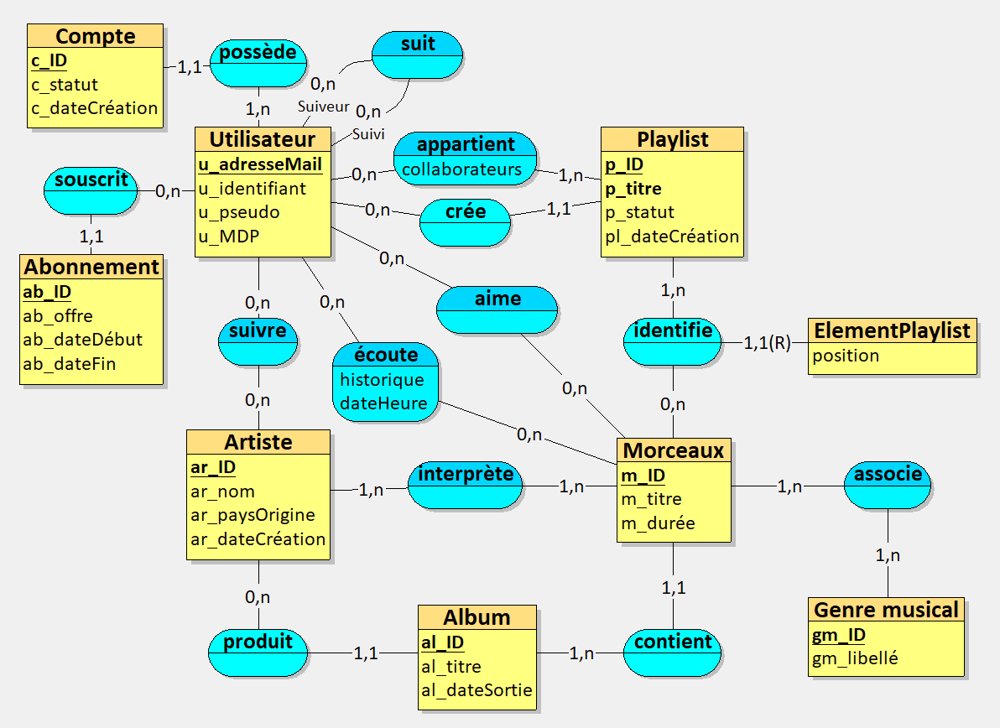

# ProjetDB_ANTOSZCZYK_BAUDET

## Etape 1 : Analyser les besoins

Nous avons choisi le domaine des plateformes d'écoute musicale en ligne telles que Spotify ou encore Deezer.

### Prompt utilisé

Tu travailles dans le domaine de la musique numérique et du streaming musical en ligne.  
Ton entreprise a comme activité de proposer une plateforme de streaming musical permettant l’écoute de morceaux, la création et la gestion de playlists, le suivi d’artistes et l’interaction entre utilisateurs.  
C’est une entreprise comme Spotify ou Deezer.

Les données ont été collectées à partir :
- des informations relatives aux utilisateurs et à leurs comptes,
- des contenus musicaux (artistes, albums, morceaux, genres),
- des playlists et de leur gestion,
- des abonnements proposés par la plateforme,
- des interactions des utilisateurs avec les contenus (écoutes, likes, suivis).

Inspire-toi des sites web officiels et de la documentation publique de Spotify et de Deezer.

Ton entreprise veut appliquer MERISE pour concevoir un système d'information. Tu es chargé de la partie analyse, c’est-à-dire de collecter les besoins auprès de l’entreprise. Elle a fait appel à un étudiant en ingénierie informatique pour réaliser ce projet, tu dois lui fournir les informations nécessaires pour qu’il applique ensuite lui-même les étapes suivantes de conception et développement de la base de données.  

D’abord, établis les règles de gestions des données de ton entreprise, sous la forme d'une liste à puce. Elle doit correspondre aux informations que fournit quelqu’un qui connaît le fonctionnement de l’entreprise, mais pas comment se construit un système d’information.  

Ensuite, à partir de ces règles, fournis un dictionnaire de données brutes avec les colonnes suivantes, regroupées dans un tableau : signification de la donnée, type, taille en nombre de caractères ou de chiffres. Il doit y avoir entre 25 et 35 données. Il sert à fournir des informations supplémentaires sur chaque donnée (taille et type) mais sans a priori sur comment les données vont être modélisées ensuite.  

Fournis donc les règles de gestion et le dictionnaire de données.

Voici ce que donne l'IAG comme informations sur les règles métier de votre domaine, et les données à stocker:

### Règles de gestion (règles métier)
- Un utilisateur doit créer un compte pour accéder au service.
- Un utilisateur est identifié par une adresse e-mail unique.
- Un utilisateur peut créer une ou plusieurs playlists.
- Une playlist appartient à un seul utilisateur créateur.
- Une playlist peut être collaborative.
- Une playlist collaborative peut être partagée avec plusieurs autres utilisateurs.
- Un utilisateur peut ajouter des morceaux dans ses playlists.
- L’ordre des morceaux dans une playlist est conservé.
- Un utilisateur peut suivre un ou plusieurs artistes.
- Un artiste peut être suivi par plusieurs utilisateurs.
- Un artiste peut produire plusieurs albums.
- Un album est publié par un seul artiste principal.
- Un album contient plusieurs morceaux.
- Un morceau appartient à un seul album.
- Un morceau est interprété par au moins un artiste.
- Un morceau est associé à un ou plusieurs genres musicaux.
- Un utilisateur peut écouter plusieurs morceaux.
- Chaque écoute d’un morceau par un utilisateur est enregistrée dans l’historique.
- Un utilisateur peut posséder un abonnement.
- Un abonnement correspond à un type d’offre (gratuit, premium, famille, étudiant, etc.).
- Un utilisateur ne peut avoir qu’un seul abonnement actif à la fois.
- Un abonnement possède une date de début et éventuellement une date de fin.
- Un utilisateur peut suivre d’autres utilisateurs.
- Un utilisateur peut être suivi par plusieurs utilisateurs.
- Un utilisateur peut aimer un ou plusieurs morceaux.
- Un morceau peut être aimé par plusieurs utilisateurs.
- Une playlist peut être rendue publique ou privée.
- Une playlist possède un titre unique pour un même utilisateur.
- Un utilisateur peut retirer un morceau de sa playlist.
- Les informations des artistes, albums et morceaux sont gérées par la plateforme.

### Dictionnaire de données brutes

(29 données – sans hypothèse de modélisation)  
- Signification de la donnée	Type	Taille
- Identifiant de l’utilisateur	entier	10
- Adresse e-mail de l’utilisateur	chaîne	150
- Mot de passe de l’utilisateur (haché)	chaîne	255
- Pseudonyme de l’utilisateur	chaîne	50
- Date de création du compte utilisateur	date	10
- Statut du compte utilisateur	chaîne	20
- Identifiant de l’artiste	entier	10
- Nom de l’artiste	chaîne	100
- Pays d’origine de l’artiste	chaîne	50
- Date de création de l’artiste	date	10
- Identifiant de l’album	entier	10
- Titre de l’album	chaîne	150
- Date de sortie de l’album	date	10
- Identifiant du morceau	entier	10
- Titre du morceau	chaîne	150
- Durée du morceau en secondes	entier	6
- Identifiant du genre musical	entier	10
- Libellé du genre musical	chaîne	50
- Identifiant de la playlist	entier	10
- Titre de la playlist	chaîne	100
- Date de création de la playlist	date	10
- Indicateur de playlist collaborative	booléen	1
- Indicateur de visibilité publique de la playlist	booléen	1
- Position du morceau dans la playlist	entier	5
- Identifiant de l’abonnement	entier	10
- Type d’abonnement	chaîne	30
- Date de début de l’abonnement	date	10
- Date de fin de l’abonnement	date	10
- Date et heure d’écoute d’un morceau	date-heure	19

### Modèle Conceptuel de Données (MCD)

Le Modèle Conceptuel de Données a été réalisé à partir des règles métiers définies précédemment.
Il respecte en effet les principes de normalisation ici la 3ème forme de normalisation (3FN). Il contient également des éléments de modélisation avancée.

On a trois éléments :
- une association récursive : un utilisateur peut suivre aucun ou plusieurs autres utilisateurs.
- plusieurs associations n-n : interprète, associe, aime, suivre).
- une entité faible : l'ElementPlaylist dépend de la Playlist.

Voici le MCD de notre plateforme d'écoute musicale en ligne :

