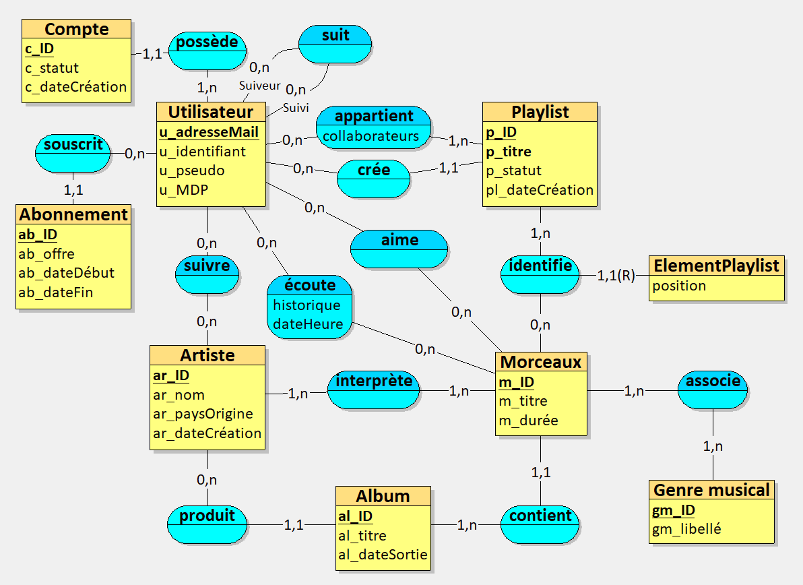

# ProjetDB_ANTOSZCZYK_BAUDET

## Etape 1 : Analyser les besoins

Nous avons choisi le domaine des plateformes d'écoute musicale en ligne telles que Spotify ou encore Deezer.

### Prompt utilisé (framework RICARDO)

Tu travailles dans le domaine de la musique numérique et du streaming musical en ligne.  
Ton entreprise a comme activité de proposer une plateforme de streaming musical permettant l’écoute de morceaux, la création et la gestion de playlists, le suivi d’artistes et l’interaction entre utilisateurs.  
C’est une entreprise comme Spotify ou Deezer.

Les données ont été collectées à partir :
- des informations relatives aux utilisateurs et à leurs comptes,
- des contenus musicaux (artistes, albums, morceaux, genres),
- des playlists et de leur gestion,
- des abonnements proposés par la plateforme,
- des interactions des utilisateurs avec les contenus (écoutes, likes, suivis).

Inspire-toi des sites web officiels et de la documentation publique de Spotify et de Deezer.

Ton entreprise veut appliquer MERISE pour concevoir un système d'information. Tu es chargé de la partie analyse, c’est-à-dire de collecter les besoins auprès de l’entreprise. Elle a fait appel à un étudiant en ingénierie informatique pour réaliser ce projet, tu dois lui fournir les informations nécessaires pour qu’il applique ensuite lui-même les étapes suivantes de conception et développement de la base de données.  

D’abord, établis les règles de gestions des données de ton entreprise, sous la forme d'une liste à puce. Elle doit correspondre aux informations que fournit quelqu’un qui connaît le fonctionnement de l’entreprise, mais pas comment se construit un système d’information.  

Ensuite, à partir de ces règles, fournis un dictionnaire de données brutes avec les colonnes suivantes, regroupées dans un tableau : signification de la donnée, type, taille en nombre de caractères ou de chiffres. Il doit y avoir entre 25 et 35 données. Il sert à fournir des informations supplémentaires sur chaque donnée (taille et type) mais sans a priori sur comment les données vont être modélisées ensuite.  

Fournis donc les règles de gestion et le dictionnaire de données.

Voici ce que donne l'IAG comme informations sur les règles métier de votre domaine, et les données à stocker:

### Règles de gestion (règles métier)
- Un utilisateur doit créer un compte pour accéder au service.
- Un utilisateur est identifié par une adresse e-mail unique.
- Un utilisateur peut créer une ou plusieurs playlists.
- Une playlist appartient à un seul utilisateur créateur.
- Une playlist peut être collaborative.
- Une playlist collaborative peut être partagée avec plusieurs autres utilisateurs.
- Un utilisateur peut ajouter des morceaux dans ses playlists.
- L’ordre des morceaux dans une playlist est conservé.
- Un utilisateur peut suivre un ou plusieurs artistes.
- Un artiste peut être suivi par plusieurs utilisateurs.
- Un artiste peut produire plusieurs albums.
- Un album est publié par un seul artiste principal.
- Un album contient plusieurs morceaux.
- Un morceau appartient à un seul album.
- Un morceau est interprété par au moins un artiste.
- Un morceau est associé à un ou plusieurs genres musicaux.
- Un utilisateur peut écouter plusieurs morceaux.
- Chaque écoute d’un morceau par un utilisateur est enregistrée dans l’historique.
- Un utilisateur peut posséder un abonnement.
- Un abonnement correspond à un type d’offre (gratuit, premium, famille, étudiant, etc.).
- Un utilisateur ne peut avoir qu’un seul abonnement actif à la fois.
- Un abonnement possède une date de début et éventuellement une date de fin.
- Un utilisateur peut suivre d’autres utilisateurs.
- Un utilisateur peut être suivi par plusieurs utilisateurs.
- Un utilisateur peut aimer un ou plusieurs morceaux.
- Un morceau peut être aimé par plusieurs utilisateurs.
- Une playlist peut être rendue publique ou privée.
- Une playlist possède un titre unique pour un même utilisateur.
- Un utilisateur peut retirer un morceau de sa playlist.
- Les informations des artistes, albums et morceaux sont gérées par la plateforme.

### Dictionnaire de données brutes

(29 données – sans hypothèse de modélisation)  
- Signification de la donnée	Type	Taille
- Identifiant de l’utilisateur	entier	10
- Adresse e-mail de l’utilisateur	chaîne	150
- Mot de passe de l’utilisateur (haché)	chaîne	255
- Pseudonyme de l’utilisateur	chaîne	50
- Date de création du compte utilisateur	date	10
- Statut du compte utilisateur	chaîne	20
- Identifiant de l’artiste	entier	10
- Nom de l’artiste	chaîne	100
- Pays d’origine de l’artiste	chaîne	50
- Date de création de l’artiste	date	10
- Identifiant de l’album	entier	10
- Titre de l’album	chaîne	150
- Date de sortie de l’album	date	10
- Identifiant du morceau	entier	10
- Titre du morceau	chaîne	150
- Durée du morceau en secondes	entier	6
- Identifiant du genre musical	entier	10
- Libellé du genre musical	chaîne	50
- Identifiant de la playlist	entier	10
- Titre de la playlist	chaîne	100
- Date de création de la playlist	date	10
- Indicateur de playlist collaborative	booléen	1
- Indicateur de visibilité publique de la playlist	booléen	1
- Position du morceau dans la playlist	entier	5
- Identifiant de l’abonnement	entier	10
- Type d’abonnement	chaîne	30
- Date de début de l’abonnement	date	10
- Date de fin de l’abonnement	date	10
- Date et heure d’écoute d’un morceau	date-heure	19

### Modèle Conceptuel de Données (MCD)

Le Modèle Conceptuel de Données a été réalisé à partir des règles métiers définies précédemment.
Il respecte en effet les principes de normalisation ici la 3ème forme de normalisation (3FN). Il contient également des éléments de modélisation avancée.

On a trois éléments :
- une association récursive : un utilisateur peut suivre aucun ou plusieurs autres utilisateurs.
- plusieurs associations n-n : interprète, associe, aime, suivre...
- une entité faible : l'ElementPlaylist du MCD dépend de la Playlist.

## Etape 2 : MCD

Voici le MCD de notre plateforme d'écoute musicale en ligne :

## Etape 3 : MLD et MPD

Voici le MLD de notre plateforme d'écoute musicale en ligne :

Artiste = (ar_ID INT, ar_nom VARCHAR(100), ar_paysOrigine VARCHAR(50), ar_dateCréation DATE);  
Album = (al_ID INT, al_titre VARCHAR(150), al_dateSortie DATE, #ar_ID);  
Genre_musical = (gm_ID INT, gm_libellé VARCHAR(50));  
Compte = (c_ID VARCHAR(50), c_statut VARCHAR(20), c_dateCréation DATE);  
Utilisateur = (u_adresseMail VARCHAR(150), u_identifiant INT, u_pseudo VARCHAR(50), u_MDP VARCHAR(255), #c_ID);  
Playlist = (p_ID INT, p_titre VARCHAR(100), p_statut VARCHAR(50), pl_dateCréation DATE, #u_adresseMail);  
Abonnement = (ab_ID INT, ab_offre VARCHAR(30), ab_dateDébut DATE, ab_dateFin DATE, #u_adresseMail);  
Morceaux = (m_ID INT, m_titre VARCHAR(150), m_durée INT, #al_ID);  
ElementPlaylist = (#p_ID, #m_ID, position_ INT);  
appartient = (#u_adresseMail, #p_ID, collaborateurs DECIMAL(15,2));  
suivre = (#u_adresseMail, #ar_ID);  
interprète = (#m_ID, #ar_ID);  
écoute = (#u_adresseMail, #m_ID, historique VARCHAR(50), dateHeure DATETIME);  
associe = (#m_ID, #gm_ID);  
aime = (#u_adresseMail, #m_ID);  
suit = (#u_adresseMail_Suivi, #u_adresseMail_Suiveur);  

## Etape 4 : Insertion des données

### Prompt

Donne les requêtes d’insertion permettant de remplir la base de données d’une plateforme de streaming musical dont le modèle relationnel est le suivant :  

Artiste (ar_ID, ar_nom, ar_paysOrigine, ar_dateCréation) PK = ar_ID  
Album (al_ID, al_titre, al_dateSortie, #ar_ID) PK = al_ID  
Genre_musical (gm_ID, gm_libellé) PK = gm_ID  
Compte (c_ID, c_statut, c_dateCréation) PK = c_ID  
Utilisateur (u_adresseMail, u_identifiant, u_pseudo, u_MDP, #c_ID) PK = u_adresseMail  
Playlist (p_ID, p_titre, p_statut, pl_dateCréation, #u_adresseMail) PK = p_ID  
Abonnement (ab_ID, ab_offre, ab_dateDébut, ab_dateFin, #u_adresseMail) PK = ab_ID  
Morceaux (m_ID, m_titre, m_durée, #al_ID) PK = m_ID  
ElementPlaylist (#p_ID, #m_ID, position_) PK = (p_ID, m_ID)  
appartient (#u_adresseMail, #p_ID, collaborateurs) PK = (u_adresseMail, p_ID)  
suivre (#u_adresseMail, #ar_ID) PK = (u_adresseMail, ar_ID)  
interprète (#m_ID, #ar_ID) PK = (m_ID, ar_ID)  
écoute (#u_adresseMail, #m_ID, historique, dateHeure) PK = (u_adresseMail, m_ID, dateHeure)  
associe (#m_ID, #gm_ID) PK = (m_ID, gm_ID)  
aime (#u_adresseMail, #m_ID) PK = (u_adresseMail, m_ID)  
suit (#u_adresseMail_Suivi, #u_adresseMail_Suiveur) PK = (u_adresseMail_Suivi, u_adresseMail_Suiveur)  

Les clés primaires correspondent aux id, sauf si autre chose est précisé.  
Les clés étrangères sont identifiées par # et doivent correspondre à des clés primaires existantes.  

Nombre de lignes souhaité :  

- 15 artistes  
- 20 albums  
- 10 genres musicaux  
- 20 comptes  
- 20 utilisateurs  
- 25 playlists  
- 20 abonnements  
- 50 morceaux  
- 60 éléments de playlist  
- 30 relations suivre artiste  
- 60 écoutes  
- 30 likes  
- 20 relations suit utilisateur  

Dans la table artiste, inclure obligatoirement les artistes suivants :  
The Weeknd, Selena Gomez, Bruno Mars, Charles Aznavour, Brent Faiyaz.  

Dans la table album, inclure obligatoirement les albums suivants :  
After Hours, Unorthodox Jukebox, Alfredo 2.  

Dans la table genres musicaux, inclure obligatoirement les genres musicaux suivants :  
jazz, pop, reggae.  

Dans la table morceaux, inclure obligatoirement les morceaux suivants :  
Escape From LA, When I Was Your Man, La Bohème, ROLE MODEL, Ensalada, E85.  

Contraintes à respecter :  

- durée des morceaux > 0 et ≤ 1200  
- statut compte ∈ ('actif','suspendu','supprime')  
- statut playlist ∈ ('publique','privee','collaborative')  
- abonnement ∈ ('gratuit','premium','famille','etudiant')  
- historique écoute ∈ ('lecture','pause','skip')  

Les clés étrangères doivent faire référence aux clés primaires existantes : donne les lignes en commençant par remplir les tables sans clés étrangères, puis les autres tables dans lesquelles les clés étrangères font référence à des clés primaires des tables déjà remplies.  

Fournis l’ensemble sous la forme d’un script SQL prêt à être exécuté.  

À la fin du fichier d’insertion, nous avons ajouté un ensemble de requêtes permettant de tester certaines contraintes d’intégrité de la base de données. Ces requêtes sont volontairement incorrectes et doivent normalement produire des erreurs lors de leur exécution.

## Etape 5: Interrogation de la base de données

### Scénario d’utilisation

La base de données représente une plateforme d’écoute de musique en ligne.  
Elle peut être utilisée par l’équipe d’analyse de la plateforme afin d’étudier l’utilisation du service par les utilisateurs et mieux comprendre leurs habitudes d’écoute.  

L’analyste souhaite notamment obtenir des informations sur :   

- les morceaux disponibles sur la plateforme  
- les playlists créées par les utilisateurs  
- les artistes suivis  
- l’activité d’écoute des utilisateurs  
- certaines statistiques d’utilisation  

Les requêtes SQL permettent donc d’extraire ces informations afin d’aider l’entreprise à analyser l’utilisation de la plateforme et améliorer ses recommandations musicales.  

### Autre scénario d’utilisation

On peut également s'intéresser à une analyse des playlists. La plateforme d'écoute musicale analyse les playlists créées par les utilisateurs afin de mieux comprendre les tendances musicales. 
Le but est d'identifier les playlist contenant le plus de morceaux, les morceaux les plus présents dans les playlists ainsi que les utilisateurs qui créent le plus de playlists.
Ces analyses permettraient de mettre en avant certaines playlists sur la page d'accueil de la plateforme. Les playlists permettraient aux utilisateurs de découvrir de nouveaux morceaux.

## Lien de la vidéo :

[vidéo mini-projet olivia baudet et sara antoszczyk](https://drive.google.com/file/d/1j8x8FdJ6esWOyuOJMNXb40H5fwdHSzHM/view?usp=drive_link)

